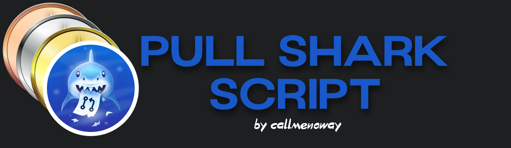

<p align="center">
  
</p>

<h1 align="center">Pull Shark Script</h1>

<p align="center"><i>Automates the creation and merging of Pull Requests on GitHub to earn the Pull Shark badge 🦈.</i></p>

<p align="center">
  <!-- Last commit -->
  
  
  <!-- Top language -->
  

  <!-- Languages count -->
  

  <!-- Repo size -->
  

  <!-- Stars -->
  

  <!-- Forks -->
  

  <!-- Issues -->
  

  <!-- License -->
  

  <!-- Watchers (optional) -->
  
</p>

<p align="center"><i>Built with the tools and technologies:</i></p>

<p align="center"> 
     
     
     
     
</p>

## Overview

This script uses [PyGithub](https://github.com/PyGithub/PyGithub) to interact with the GitHub API. It generates PRs, merges them automatically, and updates a status file (status.md) with the current count and the corresponding badge.

## Key Features

- Automatically creates temporary branches.
- Generates and merges Pull Requests instantly.
- Updates status.md with the number of merged PRs and the badge (default / bronze / silver / gold).

## Fork the Repository

Instead of cloning directly, please **fork this repository** to your own GitHub account.  
This helps support the project and gives you your own copy to experiment with 🚀  

```bash
# Fork the repo via GitHub UI, then clone your fork:
git clone https://github.com/<your-username>/Pull-Shark-Script.git
cd Pull-Shark-Script
```

## Requirements
- Python 3.8+
- PyGithub

Install dependencies:

```bash
pip install -r requirements.txt
```
## Create Token
Create a [Personal Access Token](https://github.com/settings/tokens) and name it as you prefer. You can generate the token in Settings → Developer Settings → Personal Access Token → Token (classic)

## Configuration
The script uses environment variables (or falls back to manual input):
- GITHUB_TOKEN → your GitHub personal access token (with repo permissions).
- GITHUB_REPO → target repo in the format user/repo.
- GITHUB_USER → your GitHub username.
- TARGET_PR → number of PRs to create and merge.

### Example

```bash
export GITHUB_TOKEN=ghp_xxx
export GITHUB_REPO=username/pull-request-sript
export GITHUB_USER=username
export TARGET_PR=50

python main.py
```
### Example ```status.md```

```bash
25 pull requests merged<br>Currently:<br>

```
## Disclaimer
- Risk of spam: use this script only on personal/test repos.
- Don’t abuse the GitHub API — you may hit rate limits or trigger abuse detection.
- This script is intended only to unlock the Pull Shark badge, not for production use.
## ⭐ Support
If you find this project useful, don’t forget to:

⭐ Star the repo

👤 Follow me on GitHub → [@callmenoway](https://github.com/callmenoway)

Your support motivates me to keep improving this project 💙
## License
This project is licensed under the MIT License.
